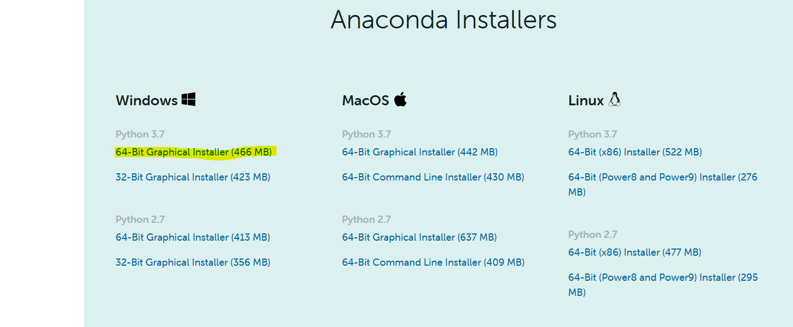
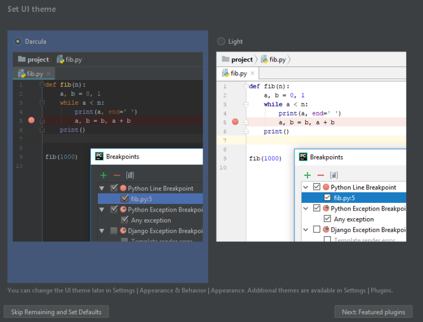

<div dir="rtl">

# פיתוח בפייתון - הכנות למחשב
כדי שנוכל לעבוד בפייתון יש כמה דברים שאנחנו צריכים להתקין ולוודא שהם עובדים על המחשב

- [פייתון עצמו](#%D7%A4%D7%99%D7%99%D7%AA%D7%95%D7%9F-%D7%A2%D7%A6%D7%9E%D7%95)
- [עורך טקסט כדי לתכנת בו](#%D7%A2%D7%95%D7%A8%D7%9A-%D7%98%D7%A7%D7%A1%D7%98-%D7%9B%D7%93%D7%99-%D7%9C%D7%AA%D7%9B%D7%A0%D7%AA-%D7%91%D7%95)
    - [אפשריות אחריות](#%D7%90%D7%A4%D7%A9%D7%A8%D7%99%D7%95%D7%AA-%D7%90%D7%97%D7%A8%D7%99%D7%95%D7%AA)


## פייתון עצמו

אנחנו צריכים להשיג את פייתון עצמו, שיידע בעצם לקרוא את התוכנות שלנו ולהריץ אותנו (עוד מידע על המנגנון הזה בהמשך הקורס). יש הרבה גרסאות עם כל מיני הרחבות שונות אבל הגרסא השימושית ביותר לנו היא כנראה אנקונדה (בהוצאת individual). אתם יכולים להוריד אותה בחינם לגמרי פה:

https://www.anaconda.com/products/individual

באתר עצמו לחצו על **download** ואתם תגיעו לאוסף של גרסאות שמתוכן תצטרכו לבחור אחת. בהנחה שאתם משתמשים ב-windows ושהמחשב שלכם נקנה ב-5 השנים האחרונות ומריץ windows 8 ומעלה, אתם כנראה צריכים את הגרסא שהיא 64bit.



אחרי שהקובץ ירד, אתם צריכים להתקין אותו עם הדגשים הבאים:
* במהלך ההתקנה אתם תישאלו האם להתקין את אנקונדה לכל המשתמשים או רק לכם, מוזמנים להתייעץ איתי על זה אבל בגדול זה תלוי במי שעוד משתמש במחשב הזה. אם רק אתם משתמשים במחשב הזה, מוזמנים להתקין עבור כל המשתמשים (all users) ולסגור עניין
* לגבי מקום ההתקנה - מוזמנים לשנות אם אתם צריכים, אבל רב הסיכויים שאין באמת צורך
* בחלון האחרון לפני הלוחצים על install ישנן שתי תיבות כאשר העליונה לא מסומנת והתחתונה כן. למטרות הקורס הזה יש לסמן את התיבה העליונה בנוסף לתחתונה (אולי הכתב יהיה באדום כשתעשו את זה). להסברים נוספים מוזמנים לפנות אליי.
* בסוף ההתקנה יופיע לכם מסך עם עוד שתי תיבות שבהן מסומן V. מוזמנים לבטל את ה-V-ים בשתי התיבות ולסיים את ההת'נה

מזל טוב, התקנתם פייתון. כדי לבדוק שהוא עובד אתם מוזמנים לפתוח מסך cmd (אני אלמד איך לעשות את זה) ולהריץ את הפקודה


<div dir="ltr">

```
python --version
```

</div>

## עורך טקסט כדי לתכנת בו
תכנות הוא כתיבת קוד, שזה בעצם כתיבת מילים, אז אנחנו צריכים תוכנה שבה אפשר לכתוב קבצי טקסט פשוטים. בגדול לכולנו יש על המחשב את notepad שמאפשר לעשות את זה אבל הוא מאוד לא נוח, ובעולם היו קיימים עורכי טקסט שנועדו במיוחד לכתיבת קוד והם באים עם המון יתרונות (שאתם חלקם אנחנו נכיר). יתרון אחד שכזה הוא שהעורך מסמן את הטקסט בצבעים שונים כדי להדגיש מילים מסוימות שמעניינות אותנו יותר או פחות. יתרון שני הוא שהעורך מאפשר להריץ את התכונה שלנו ישירות מתוכו.

עורך אחד מאוד פופולארי בעולם הזה הוא pycharm ואתם מוזמנים להוריד אותו מפה:
https://www.jetbrains.com/pycharm/download

ושם תבחרו להוריד את גרסת ה-community - זאת הגרסא החינמית והלא מוגבלת.
אחרי הורדה אתם מוזמנים להתקין את התוכנה. אין דגשים מיוחדים להתקנה עצמה.
אחרי ההתקנו תפעילו את pycharm, אשרו את תנאי ההפעלה ואתם תגיעו למסך הזה:



שבו תצטרכו לבחור האם אתם רוצים את הגרסא הכהה או הבהירה של התכונה. תבחרו מה שנוח, אפשר לשנות את זה אחר כך. ואחרי זה לחצו על הכפתור בצד שמאל למטה, כדי לא להתחיל להתעסק בכל מיני רכיבים שונים של התכונה שא רלוונטיים בשלב זה.

### **אפשריות אחריות**
ישנם הרבה עורכים אחרים שמתאימים לפייתון, אני לדוגמא מאוד אוהב את vsCode מכל מיני סיבות, אבל מה שהופך את העורך הזה לעורך שמאוד טוב למפתח מנוסה זה בדיוק הדבר שהופך אותו למעצבן ולא נוח למפתחים חדשים, ולכן אני מציע לכם להתחיל ב-pycharm ובהמשך הקורס אם תרצו ותחליטו שזה חשוב לכם, אני אעזור לכם לעבור לעורכים אחרים.


</div>