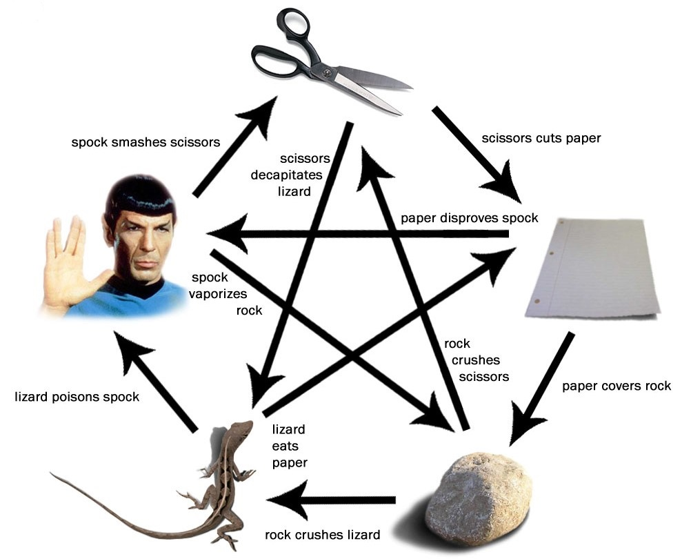

# תרגיל אבן נייר ומספריים

בתרגיל זה אנחנו הולכים לכתוב תכונה פשוטה (גם אם היום היא לא תיראה פשוטה) שבה אנחנו נאפשר לשחקנים לשחק אבן נייר ומספריים. אתם מוזמנים לרוץ על כל התרגיל מההתחלה עד הסוף כבר עכשיו לבד ולראות לאן תגיעו. התרגיל עצמו מחולק לחלקים קטנים יותר כדי שיהיה לכם נוח לכתוב את התרגיל בשלבים.

## תכנון והבנה
לרגע נשקול איך נראית התוכנה שלנו. בגדול יש לה באמת רק שני שלבים:
1. שלב הקלט - אנחנו מבקשים קלט מהמשתמש - במקרה שלנו אנחנו רוצים את הבחירה של כל אחד מהשחקנים (האם הוא בוחר אבן, נייר  או מספריים).
2. חישוב והכרזת המנצח - אנחנו נסתכל על שני הקלטים שקיבלנו, ונראה מי משני השחקנים שלנו הוא המנצח.

אוקיי, זאת המשימה בקווים כלליים. בואו נתעמק לרגע בבכמה נקודות.

### קלט מהמשתמש
זה הזמן להזכיר שהתוכנות שאנחנו כותבים הן תוכנות מבוססות טקסט, כלומר כל התקשורת שלנו עם המשתמשים הן עם טקסט, ולא עם כפתורים ובאנרים יפים (אין מה לעשות, ככה מתחילים). אז המשתמש צריך להגיד לנו בטקסט האם הוא בוחר באבן, נייר, או מספריים. אני אישית כמשתמש הייתי מתעצבן אם היו דורשים ממני להקליד באנגלית מה אני בוחר (כי אני אף פעם לא זוכר מכה S וכמה C יש במילה scissors) ולכן אופציה טובה יותר תהיה כנראה לבקש מהמשתמש אות אחת או ספרה אחת עבור הבחירה. לדוגמא 1 לאבן, 2 לנייר ו-3 למספריים. או r לאבן p לנייר ו-s למספריים. שימו לב שאם אתם בוחרים באופציה השניה, של לבקש אות, פייתום (ורוב שפות התכנות) עושים הפרדה ברורה בין אותיות גדולות לקטנות ולמעשה מבחינת השפה אלה שתי אותיות שונות לחלוטין, ולכן הקפידו על זה.

### תנאי ניצחון
אם אנחנו חושבים על משחק של אבן-נייר-ומספריים בין שני אנשים פירושו שיש לנו שני אנשים שכל אחד מהם מסוגל לבחור אפשרות אחת מבין 3. כמה אפשרויות שונות יש? [יש תחום מתמטי (די מעניין) שמתעסק בזה](https://he.wikipedia.org/wiki/%D7%A7%D7%95%D7%9E%D7%91%D7%99%D7%A0%D7%98%D7%95%D7%A8%D7%99%D7%A7%D7%94#%D7%97%D7%9C%D7%99%D7%A4%D7%95%D7%AA) אבל זה לא מה שבאנו ללמוד פה, ולכן אני אספר לכם שישנן 9 אפשרויות שונות לבחירות של השחקנים. זה אומר שלכאורה אנחנו אמורים לכתוב 9 תנאים שונים כדי להחליט מי ניצח. זה ייראה בערך ככה:

* אם שחקן א' בחר אבן ושחקן ב' בחר אבן - תיקו
* אם שחקן א' בחר אבן ושחקן ב' בחר מספריים - שחקן א' ניצח
* אם שחקן א' בחר אבן ושחקן ב' בחר נייר - שחקן ב' ניצח
* אם שחקן א' בחר נייר ושחקן ב' בחר נייר - תיקו

וכו'...

זה יהיה די ארוך. אבל חשוב להבהיר, שיש דרך לקצר קצת את התנאים. מתוך 9 האפשרויות שקיימות, שלוש הן אפשרויות של תיקו שניתן לתאר בתור "שחקן א' ושחקן ב' בחרו באותה אפשרות". זה מצב שקל לבדוק עם תנאי, ולכן אפשרי לקצר לפחות 3 תנאים של תיקו לתנאי אחד.

האמת היא שיש עוד החלפה שאפשר לעשות כדי לקצר את העבודה, ואני אתן על זה רמז בהמשך.

## מתחילים לפתח
### שלב א' - קלט

#### בקשת קלט מהמשתמש הראשון
אחרי שבשלב התכנון החלטתם מה האופן שבו שאתם הולכים לייצג כל אחת מהאפשרויות של המשתמש (אבן, נייר ומספריים) השלב הראשון בתוכנה הוא להדפיס הודעה למשתמש שמברכת אותו עם כניסתו למשחק, מסבירה לו את אפשרויות הבחירה לפניו (לדוגמא: בחר את s או p או r) ומבקשת ממנו לבחור

#### בדיקת הקלט
זה משהו שיקרה הרבה. אחרי שהמשתמש ביצע בחירה, אנחנו צריכים לוודא שהבחירה שהוא נתן לנו היא באמת אחת מהאפשרויות שנתנו לו. אתם יודעים תנאים (ותנאים מורכבים) אז אתם אמורים להצליח לבדוק האם הבחירה שהמשתמש נתן מייצגת את אחת האפשרויות הללו. אם הבחירה שלו לא הגיונית, אתם מוזמנים לצאת מהתוכנה. אם אתם ממש נחמדים אתם יכולים להדפיס הודעה למשתמש שהוא בחר ערך לא טוב, ואז לצאת מהתוכנה.

#### שחקן שני
אוקיי, אז אחרי שקיבלנו קלט מהשחקן הראשון ווידאנו שהוא חוקי, צריך לעשות בדיוק אותו הדבר עם השחקן השני. בקשו ממנו את קלט, ובדקו שהוא חוקי

### שלב ב' - תוצאה

#### האם תיקו
הדבר הנוח הראשון לעשות אחרי שיש לנו את שני הקלטים הוא לבדוק האם יש תיקו. בשביל זה אנחנו לא צריכים לבדוק 3 תנאים שונים, אלא רק תנאי אחד - האם הבחירה של שחקן א' שווה לבחירה של שחקן ב'. אם כן ניתן להכריז על תיקו ולסיים

#### האפשרויות האחרות
נשארו לנו 6 תנאים (אחרי שטיפלנו בענייני התיקו) ועכשיו צריך לבדוק כל אחד מהם בקוד ולהכריז על התוצאה בהתאם. זה קצת מציק, ובהמשך הלימוד נלמד דרכים טובות יותר לעשות את זה, אבל בינתיים, זה מה יש, ועם זה ננצח. 6 תנאים לבדיקות ו6 הכרזות על ניצחון. בהצלחה.

לאלו מכם שרוצים להתנסות קצת בחשיבת לוגית אני אספר שניתן לעשות עוד קיצור. למעשה במקום 6 אפשרויות שונות, ניתן לקצר את זה ל-4 אפשרויות שונות, או יותר נכון ל-3 אפשרויות וכל השאר. מוזמנים לחשוב איך לעשות את זה.

## גרסא למתקדמים
למתקדמים שרוצים להרחיב את העניין - מוזמנים לעדכן את התוכנה המרהיבה שלכם כדי לשחק ["אבן, נייר, מספריים, לטאה וספוק"](https://bigbangtheory.fandom.com/wiki/Rock,_Paper,_Scissors,_Lizard,_Spock)

> Live long, and posper